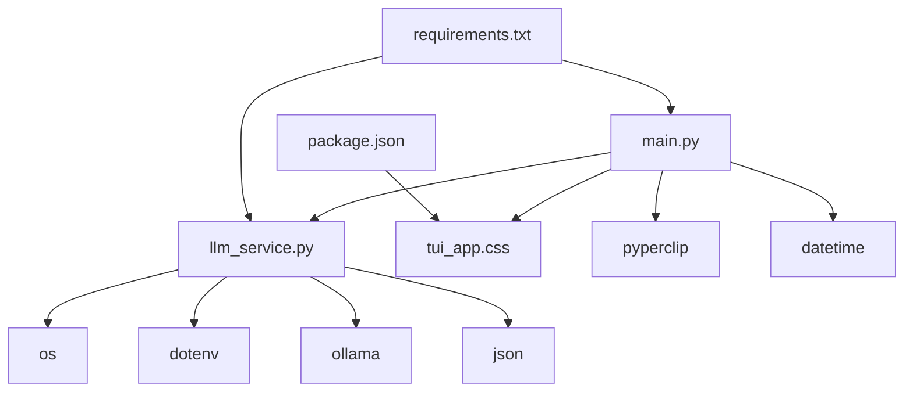
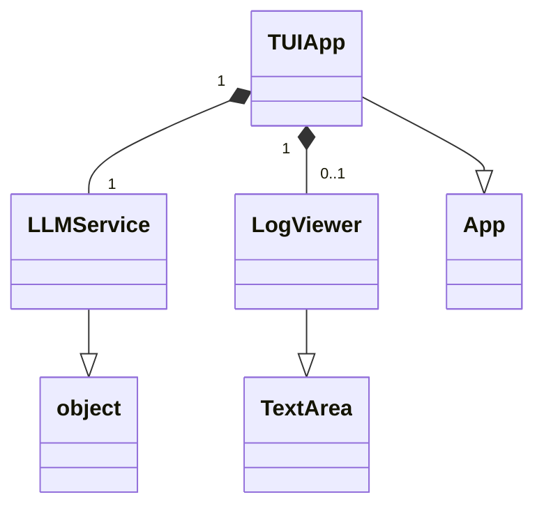
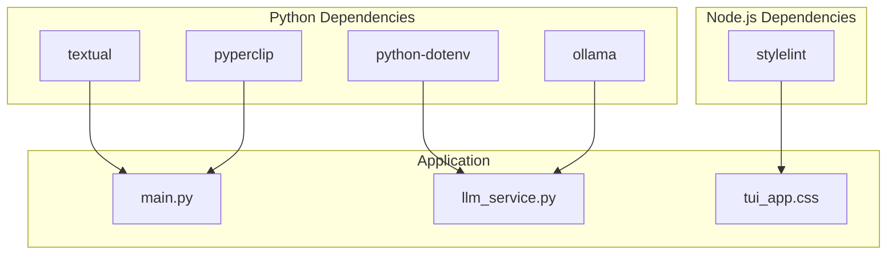

This project is a Text-based User Interface (TUI) utility that allows users to generate Linux shell commands using natural language. It leverages an LLM (Large Language Model) to interpret user requests and provide corresponding commands and explanations.

## Purpose

The purpose of this solution, as described in `spec.md`, is to provide a command-line utility that:
- Presents a text box for natural language input.
- Calls an LLM API to get specific Linux commands.
- Displays the generated commands and their explanations in separate text areas.
- Copies the selected commands to the clipboard upon pressing Enter.
- Is written in Python using the Textual framework.
- Includes a log viewer for diagnostics.

## How the Solution Works

The solution consists of two main Python components: `main.py` which implements the TUI using Textual, and `llm_service.py` which handles the interaction with the LLM.

### Main Components and Source Files

*   **`main.py`**: This file contains the `TUIApp` class, which is the core of the Textual application.
    *   It sets up the TUI layout with input and output text areas using `textual.widgets.Input`, `textual.widgets.TextArea`, and `textual.containers.Container`.
    *   It handles user input, specifically the "Enter" key press in the command input area, to trigger the LLM call.
    *   It displays the commands and explanations received from the `LLMService`.
    *   It provides key bindings for quitting the application (`q`), copying commands to the clipboard (`c`), and showing a log viewer (`l`).
    *   It uses `pyperclip` for clipboard operations.
    *   It includes a `LogViewer` class to display diagnostic logs within the TUI.

*   **`llm_service.py`**: This file defines the `LLMService` class, responsible for interacting with the Large Language Model.
    *   It loads the Ollama API URL and model name from environment variables using `dotenv`.
    *   The `get_commands` method makes an API call to the configured Ollama instance, sending the user's natural language query and a system prompt.
    *   It parses the JSON object from the Ollama response to extract the generated commands and their explanations.
    *   It includes robust error handling for API communication and JSON decoding issues.

*   **`tui_app.css`**: This CSS file styles the Textual application, defining the appearance of containers and text areas.

*   **`requirements.txt`**: This file lists the Python dependencies for the project, such as `textual`, `python-dotenv`, `ollama`, and `pyperclip`.

*   **`package.json`**: This file lists the Node.js dependencies for the project, which are development tools like `stylelint` for CSS linting.

### Mermaid Diagrams

#### File Associations

#### Class Associations

#### Package Associations

